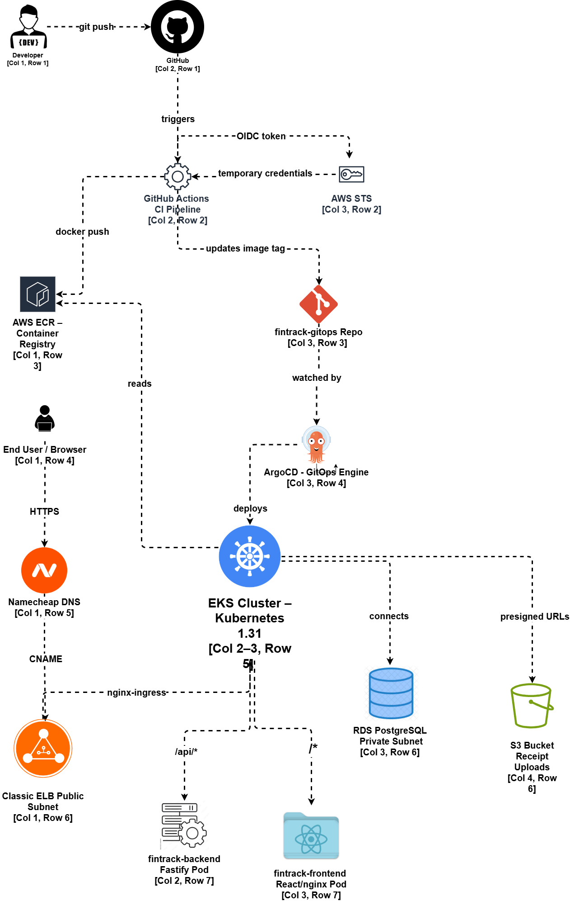

# FinTrack Infrastructure

Production-grade GitOps infrastructure for [FinTrack] - a personal finance tracker deployed on AWS EKS using ArgoCD, GitHub Actions OIDC, Terraform, and Sealed Secrets.

<!-- ## Live Demo -->

<!-- **[https://fintrack.qossim005.online](https://fintrack.qossim005.online)** -->

## Architecture Overview



## Stack

 Layer         | Technology                                       
 ------------- | ------------------------------------------------ 
 Cloud         | AWS (EKS, RDS, S3, ECR, IAM)                     
 IaC           | Terraform (modular, remote state)                
 Orchestration | Kubernetes 1.31 on EKS                           
 CI            | GitHub Actions with OIDC (no stored credentials) 
 CD            | ArgoCD (pull-based GitOps)                       
 Secrets       | Bitnami Sealed Secrets                           
 TLS           | cert-manager + Let's Encrypt                     
 Ingress       | nginx-ingress + Classic ELB                      
 Monitoring    | Prometheus + Grafana (kube-prometheus-stack)     
 DNS           | Namecheap CNAME → AWS ELB                        

## Repository Structure

```
fintrack-infrastructure/   - this repo - Terraform modules
fintrack-gitops/           - Kubernetes manifests (ArgoCD watches this)
fintrack-frontend/         - React + Vite application
fintrack-backend/          - Node.js + Fastify + Prisma API
```

 Repo                                                             | Description                               
 ---------------------------------------------------------------- | ----------------------------------------- 
 [fintrack-frontend](https://github.com/qezman/fintrack-frontend) | React + Vite frontend                     
 [fintrack-backend](https://github.com/qezman/fintrack-backend)   | Fastify + Prisma + PostgreSQL API         
 [fintrack-gitops](https://github.com/qezman/fintrack-gitops)     | GitOps manifests - ArgoCD source of truth 

## Key Engineering Decisions

- **GitOps over push-based CD** - ArgoCD pulls from Git rather than CI pushing to the cluster. Deployments are auditable, reversible, and drift is auto-corrected.
- **OIDC over stored credentials** - GitHub Actions assumes an IAM role via OpenID Connect. No AWS keys stored anywhere.
- **IRSA over instance profiles** - The backend pod assumes a scoped IAM role via Kubernetes service account annotation. S3 access is pod-specific, not node-wide.
- **Sealed Secrets over plaintext** - Secrets are encrypted with the cluster's public key before being committed to Git. The private key never leaves the cluster.
- **Modular Terraform** - Each infrastructure component (VPC, EKS, RDS, S3, IAM) is an independent reusable module. The environment layer wires them together.

## Infrastructure Components

 Component | Details                                                                    
 --------- | -------------------------------------------------------------------------- 
 VPC       | 10.0.0.0/16, 2 public + 2 private subnets across us-east-1a and us-east-1b 
 EKS       | Kubernetes 1.31, t3.small nodes, managed node group                        
 RDS       | PostgreSQL 16, db.t3.micro, private subnets only                           
 S3        | Private bucket for receipt uploads, presigned URL access                   
 ECR       | Private image registry, 10-image lifecycle policy                          

## Remote State

Terraform state is stored remotely in S3 with DynamoDB locking:

```
S3 Bucket:      terraform-fintrack-state-203637463799
DynamoDB Table: fintrack-terraform-locks
Region:         us-east-1
```

## Getting Started

### Prerequisites

- AWS CLI configured with appropriate IAM permissions
- Terraform >= 1.5.0
- kubectl
- Helm >= 3.0
- kubeseal

### Phase 1 - Infrastructure

```bash
cd environments/dev

# Phase 1: AWS infrastructure only
terraform apply \
  -target=module.vpc \
  -target=module.eks \
  -target=module.rds \
  -target=module.s3 \
  -target=module.iam \
  -auto-approve

# Reconnect kubectl
aws eks update-kubeconfig --name fintrack-dev --region us-east-1

# Phase 2: Cluster bootstrap (ArgoCD, nginx-ingress, cert-manager, sealed-secrets)
terraform apply -auto-approve
```

### Phase 2 - GitOps

```bash
# Apply ArgoCD application manifests
kubectl apply -f https://raw.githubusercontent.com/qezman/fintrack-gitops/main/apps/frontend.yaml
kubectl apply -f https://raw.githubusercontent.com/qezman/fintrack-gitops/main/apps/backend.yaml
kubectl apply -f https://raw.githubusercontent.com/qezman/fintrack-gitops/main/manifests/clusterissuer.yaml
```

### Phase 3 - Database

```bash
# Run Prisma migrations
kubectl run prisma-migrate \
  --image=203637463799.dkr.ecr.us-east-1.amazonaws.com/fintrack-backend:latest \
  --restart=Never \
  --namespace=fintrack \
  --overrides='{
    "spec": {
      "containers": [{
        "name": "prisma-migrate",
        "image": "203637463799.dkr.ecr.us-east-1.amazonaws.com/fintrack-backend:latest",
        "command": ["npx", "prisma", "db", "push"],
        "envFrom": [{"secretRef": {"name": "fintrack-backend-secrets"}}]
      }],
      "serviceAccountName": "fintrack-backend"
    }
  }'
```

## Monitoring

```bash
# Access Grafana
kubectl port-forward -n monitoring svc/kube-prometheus-stack-grafana 3000:80

# Access Prometheus
kubectl port-forward -n monitoring svc/prometheus-operated 9091:9090
```

Grafana: `http://localhost:3000` — admin / fintrack-grafana-2025

> Destroy when not in use: `terraform destroy -auto-approve`

## Author

**Kazeem**
